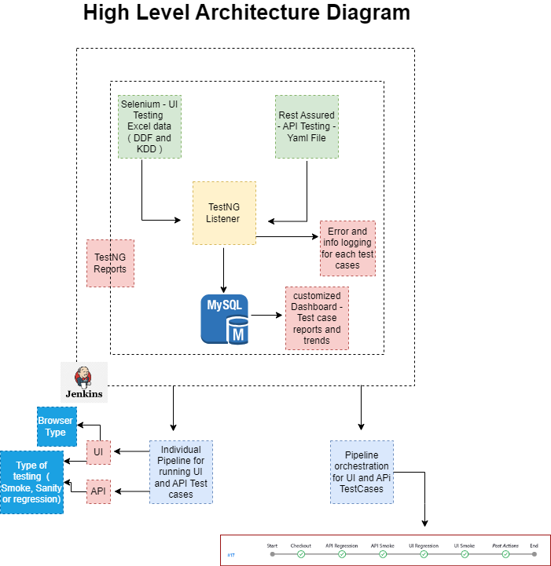

You can find the skeleton automation framework for both Frontend (UI) and Backend (API) testing with Jenkins CI/CD integration. The framework is built using Selenium, Rest Assured, and TestNG with Java ( Maven project ).

Please find the Jenkins Pipelines Script - pipelines folder

Please find the High Level Architecture diagram :

