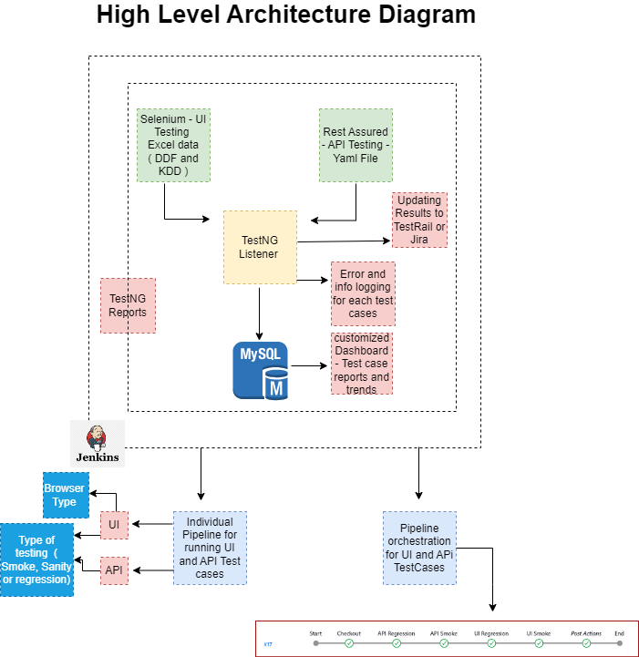
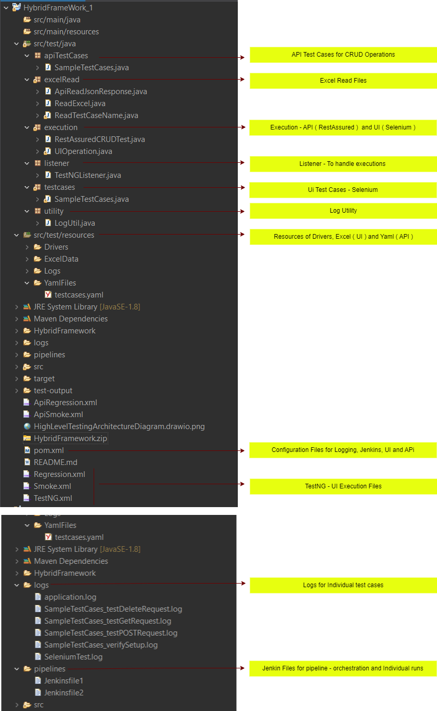

You can find the  for both Frontend (UI) and Backend (API) testing with Jenkins CI/CD integration. The framework is built using Selenium, Rest Assured, and TestNG with Java ( Maven project ).

I developed the skeleton automation framework, It utilizes Selenium-UI and Rest Assured (API Testing) for executing test cases defined in DDF and KDD format. The TestNG Listener I implemented captures the test results and updates them to TestRail or Jira, while also logging errors for each test case. I incorporated MySQL for storing customized dashboards, test case reports, and trends. The framework I built supports various types of testing (UI, API) across different browser types, including Firefox, Chrome, Smoke, and Sanity. The Pipeline orchestration module I developed manages the execution of UI and API test cases through individual Pipelines.

Please find the High Level Architecture diagram :

The file structure showcases the organization of the codebase I structured. The src/test/java directory houses the API Test Cases for CRUD operations, Excel Read files, execution modules for API (RestAssured) and UI (Selenium), Listener for handling executions, UI Test Cases (Selenium), and Log Utility that I implemented. The src/test/resources folder I created contains Drivers, Excel data, Logs, and YAML files for test cases. I included configuration files for logging, Jenkins, UI, and API. The TestNG.xml file I set up stores the UI execution configuration. Additionally, I incorporated logs for individual test cases and Jenkins files for pipeline orchestration and individual runs.

Please find the FIle Structure diagram :

